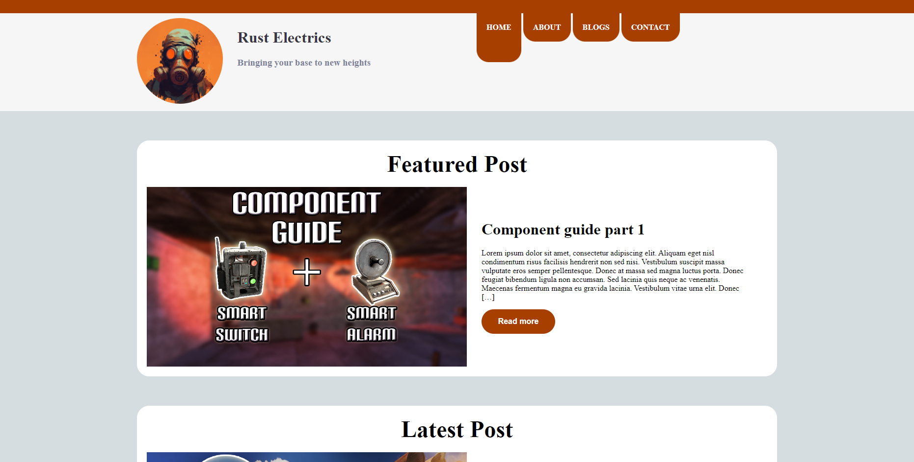

# Project exam 1 - Blog website

## Description

Here is a simple yet easy to use blog page template. Scales to fit all devices and is pleasing to the eye. The template is built using the wordpress rest api. So posting new blogs is easy and userfrienly.

## Built With

- HTML/CSS/JS
- Wordpress rest API

## Getting Started

### Installing

1. Clone the repo.
2. Edit the JS files with the wordpress link appropriate for your page.
3. Save the changes

### Running

To run the app, do the following:

1. Open the index.html file.
2. Or upload the page to a webhost

## Contact

You can contact me on [www.mrdigi.tv](https://mrdigi.tv/contact/)
